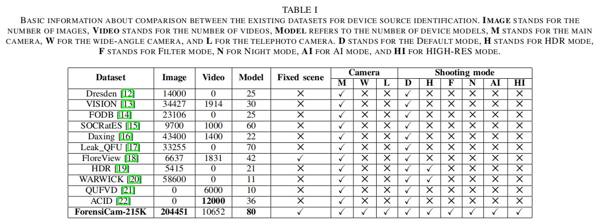
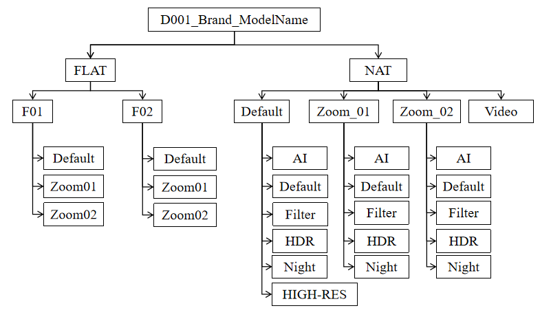
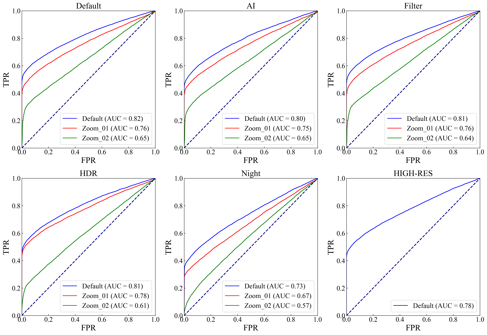
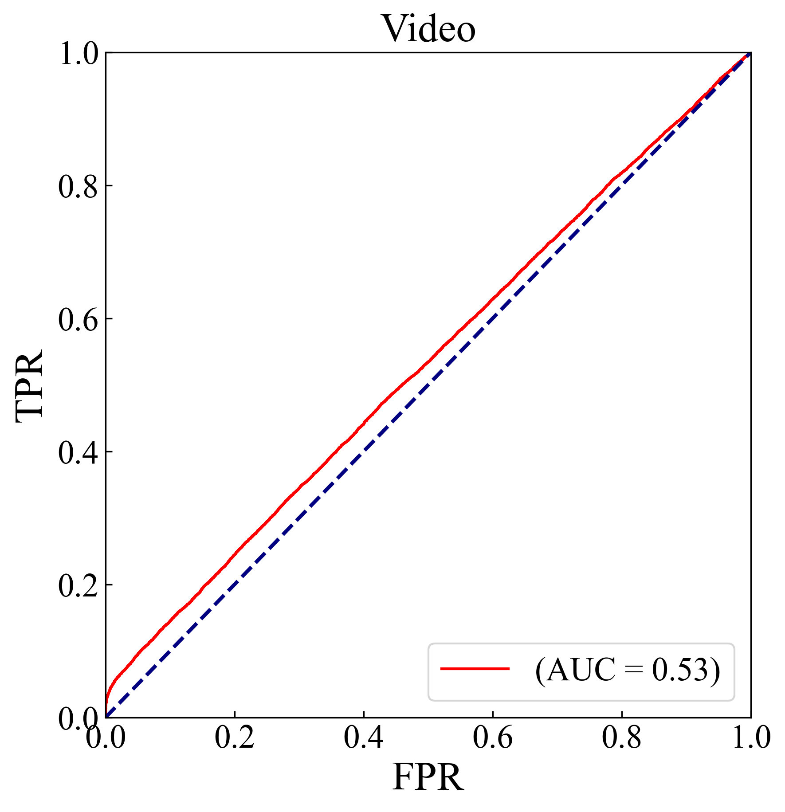

# ForensiCam-215K

A Large-Scale Image and Video Dataset for Forensic Analysis:
An official public dataset for paper "ForensiCam-215K: A Large Scale Image and Video Dataset for Forensic Analysis" (Accepted to IEEE ICASSP 2025)

## Background

Determining the origin of a digital image or video, namely device source identification, is widely used in courtroom evidence and copyright protection. Currently, device source identification primarily focuses on images captured using single camera with default settings. However, with the advancement of imaging technology, there is a large number of smartphones equipped with multiple cameras and various shooting modes for acquiring images, which may pose a significant challenge to device source identification. Therefore, to assess the performance of image source identification algorithm for modern smartphones and promote further research, it is crucial to build a dataset of image and video captured by modern smartphones. In this paper, we present a large-scale image and video dataset for forensic analysis, ForensiCam-215K. The dataset includes over 215K media contents captured by 130 modern smartphones of 10 major brands. We used the latest equipment to capture images from the main, wide-angle, and telephoto cameras in six different shooting modes, and the media were collected under a strictly controlled procedure to reduce the bias caused by differences in the acquisition process between different devices. Additionally, we used the Photo Response Non-Uniformity (PRNU) method to perform device source identification tests on the dataset. The results indicate that device source identification is a challenging task especially for images and videos captured by smartphones with multiple cameras and various shooting modes. The dataset will be released as open-source and freely available for use by the digital forensics community.

  
  

 

## ForensiCam-215K dataset device information

We selected popular smartphone brands currently on themarket for image collection, including Apple, Huawei, Honor, Redmi, OnePlus, Samsung, Oppo, Realme, Vivo, and Xiaomi, totaling 10 brands, 80 models, 130 devices, with the following specific information.

| **ID**   | **Brand** | **Model**                | **Operating System** | **Baseband Version**                                 | **Number of Cameras** | **Model Number** |
|----------|-----------|--------------------------|-----------------------|-----------------------------------------------------|-----------------------|------------------|
|	D006	|	Apple	|	iPhone12	|	ios15.4	|	2.53.01	|	2	|	MGH53CH/A	|
|	D035	|	Apple	|	iPhone12	|	ios16.3.1	|	3.40.01	|	2	|	MJND3CH/A	|
|	D051	|	Apple	|	iPhone12	|	ios16.6.1	|	3.40.01	|	2	|	MGGU3CH/A	|
|	D092	|	Apple	|	iPhone12	|	ios16.0	|	3.07.00	|	2	|	MJNC3CH/A	|
|	D105	|	Apple	|	iPhone12	|	ios16.3.1	|	3.40.01	|	2	|	MGH23CH/A	|
|	D122	|	Apple	|	iPhone12	|	ios16.6	|	3.80.01	|	2	|	MGGU3CH/A	|
|	D073	|	Apple	|	iPhone13	|	ios16.3	|	2.40.01	|	2	|	MLE23CH/A	|
|	D090	|	Apple	|	iPhone13	|	ios16.7.2	|	2.80.01	|	2	|	MLDY3CH/A	|
|	D120	|	Apple	|	iPhone13	|	ios17.1.2	|	3.20.05	|	2	|	MLE13CH/A	|
|	D016	|	Apple	|	iPhone14	|	ios17.1.2	|	2.10.03	|	2	|	MPW13CH/A	|
|	D043	|	Apple	|	iPhone14	|	ios16.0	|	1.00.05	|	2	|	MPW73CH/A	|
|	D050	|	Apple	|	iPhone14	|	ios17.2.1	|	2.20.06	|	2	|	MVV03CH/A	|
|	D018	|	Apple	|	iPhone14Pro	|	ios16.4	|	1.67.04	|	3	|	MQ0W3CH/A	|
|	D032	|	Apple	|	iPhone14Pro	|	ios17.1.1	|	2.10.03	|	3	|	MQ0W3CH/A	|
|	D019	|	Apple	|	iPhone14ProMax	|	ios17.2.1	|	2.20.06	|	3	|	MQ873CH/A	|
|	D030	|	Apple	|	iPhone14ProMax	|	ios17.1.2	|	2.10.03	|	3	|	MQ873CH/A	|
|	D127	|	Apple	|	iPhone14ProMax	|	ios17.2.1	|	2.20.06	|	3	|	MQ893CH/A	|
|	D069	|	Apple	|	iPhone15	|	ios17.0.2	|	1.00.03	|	2	|	MTLE3CH/A	|
|	D053	|	Apple	|	iPhoneXr	|	ios14.3	|	3.02.02	|	1	|	NT302LL/A	|
|	D112	|	Honor	|	50	|	Android12	|	2,672,226,722	|	4	|	NTH-AN00	|
|	D126	|	Honor	|	50	|	Android12	|	2,672,226,722	|	4	|	NTH-AN00	|
|	D059	|	Honor	|	70	|	Android12	|	\	|	3	|	FNE-AN00	|
|	D089	|	Honor	|	9X	|	HarmonyOS3.0	|	21C20B098S000C000	|	3	|	HLK-AL00	|
|	D070	|	Honor	|	Magic3	|	Android12	|	2672226722	|	3	|	ELZ-AN00	|
|	D087	|	Honor	|	V10	|	HarmonyOS3.0.0	|	21C20B369S020C000	|	2	|	BKL-TL10	|
|	D045	|	Honor	|	V40	|	Android12	|	MOLY.NR15.R3.TC36.PR2.SP.V1.P90.M	|	3	|	YOK-AN10	|
|	D072	|	Honor	|	V40LightLuxuryEdition	|	Android12	|	MOLY.NR15.R3.TC36.PR2.SP.V1.P96	|	4	|	ALA-AN70	|
|	D066	|	Honor	|	X20se	|	Android11	|	4.1.0.189(C00E106R3P21) GPU Turbo	|	3	|	CHL-ANOO	|
|	D093	|	Huawei	|	enjoy20SE	|	Android10	|	21C50B280S000C000,21C50B280S000C000	|	3	|	PPA-AL20	|
|	D022	|	Huawei	|	mate30EPro	|	Harmony OS 4.0	|	21C93B393S000C000,21C93B393S000C000	|	3	|	LIO-AN00m	|
|	D020	|	Huawei	|	mate30Pro5G	|	HarmonyOS3.0.0	|	21C93B392S000C000,21C93B392S000C000	|	4	|	LIO-AN00	|
|	D097	|	Huawei	|	mate30Pro5G	|	HarmonyOS3.0.0	|	21C93B392S000C000,21C93B392S000C000	|	4	|	LIO-AN00	|
|	D083	|	Huawei	|	mate40	|	HarmonyOS4.0.0	|	21C20B689S000C000,21C20B689S000C000	|	3	|	OCE-AN10	|
|	D077	|	Huawei	|	mate40E	|	HarmonyOS4.0	|	21C93B395S000C000,21C93B395S000C000	|	3	|	OCE-AL50	|
|	D056	|	Huawei	|	mate40Pro	|	HarmonyOS3.0.0	|	21C20B683S000C000,21C20B683S000C000	|	3	|	NOH-AN01	|
|	D108	|	Huawei	|	mate40Pro	|	HarmonyOS 4.0.0	|	21C20B689S000C000,21C20B689S000C000	|	3	|	NOH-AN00	|
|	D029	|	Huawei	|	nova5Pro	|	HarmonyOS3.0	|	21C20B393S000C000,21C20B393S000C000	|	4	|	SEA-AL10	|
|	D129	|	Huawei	|	nova5Pro	|	HarmonyOS3.0.0	|	21C20B393S000C000,21C20B393S000C000	|	4	|	SEA-AL10	|
|	D055	|	Huawei	|	nova7Pro	|	HarmonyOS4.0.0	|	21C93B395S000C000,21C93B395S000C000	|	4	|	JER-AN10	|
|	D063	|	Huawei	|	nova7Pro	|	HarmonyOS4.0.0	|	21C93B395S000C000,21C93B395S000C000	|	4	|	JER–AN20	|
|	D042	|	Huawei	|	nova7se	|	HarmonyOS3.0.0	|	21C93B391S000C000,21C93B391S000C000	|	4	|	CDY-AN00	|
|	D028	|	Huawei	|	p40Pro	|	HarmonyOS4.0	|	21C93B395S000C000,21C93B395S000C000	|	4	|	ESL-AN00	|
|	D065	|	Huawei	|	p40Pro	|	HarmonyOS4.0	|	21C93B395S000C000,21C93B395S000C000	|	4	|	ELS-AN00	|
|	D104	|	OnePlus	|	9	|	Android14	|	Q_V1_P14,Q_V1_P14	|	3	|	LE2110	|
|	D015	|	OnePlus	|	9r	|	Android13	|	Q_V1_P14,Q_V1_P14	|	4	|	LE2100	|
|	D076	|	OnePlus	|	9r	|	Android13	|	Q_V1_P14,Q_V1_P14	|	4	|	LE2100	|
|	D034	|	OnePlus	|	Ace2	|	Android13	|	Q_V1_P14,Q_V1_P14	|	3	|	PHK110	|
|	D061	|	OnePlus	|	AcePro	|	Android13	|	Q_V1_P14,Q_V1_P14	|	3	|	PGP110	|
|	D094	|	Oppo	|	A96	|	Android12	|	Q_V1_P14,Q_V1_P14	|	2	|	PFUM10	|
|	D048	|	Oppo	|	FindX3	|	Android13	|	Q_V1_P14,Q_V1_P14	|	4	|	PEDM00	|
|	D075	|	Oppo	|	FindX3	|	Android13	|	Q_V1_P14,Q_V1_P14	|	4	|	PEDM00	|
|	D124	|	Oppo	|	Reno5K	|	Android12	|	Q_V1_P14,Q_V1_P14	|	4	|	PEGM5K	|
|	D096	|	Oppo	|	Reno5Pro	|	Android12	|	M_V3_P10,M_V3_P10	|	3	|	PDSM00	|
|	D068	|	Oppo	|	Reno6Pro	|	Android11	|	M_V3_P10,M_V3_P10	|	4	|	PEPM00	|
|	D002	|	Oppo	|	Reno6Pro+	|	Android13	|	Q_V1_P14,Q_V1_P14	|	4	|	PENM00	|
|	D044	|	Oppo	|	Reno6Pro+	|	Android13	|	Q_V1_P14,Q_V1_P14	|	4	|	PENM00	|
|	D047	|	Oppo	|	Reno6Pro+	|	Android13	|	Q_V1_P14,Q_V1_P14	|	4	|	PENM00	|
|	D113	|	Oppo	|	Reno6Pro+	|	Android13	|	Q_V1_P14,Q_V1_P14	|	4	|	PENM00	|
|	D007	|	Oppo	|	Reno6Pro5G	|	Android13	|	M_V3_P10,M_V3_P10	|	4	|	PEPM00	|
|	D011	|	Oppo	|	Reno9	|	Android14	|	Q_V1_P14,Q_V1_P14	|	2	|	PHM110	|
|	D060	|	Oppo	|	Reno9	|	Android14	|	Q_V1_P14,Q_V1_P14	|	2	|	PHM110	|
|	D078	|	Realme	|	GTMasterExplorerEdition	|	Android13	|	Q_V1_P14,Q_V1_P14	|	2	|	RMX3366	|
|	D003	|	Realme	|	GTNeo3	|	Android13	|	M_V3_P10,M_V3_P10	|	3	|	RMX3560	|
|	D008	|	Realme	|	GTNeo5	|	Android14	|	Q_V1_P14,Q_V1_P14	|	3	|	RMX3706	|
|	D119	|	Realme	|	GTNeoFlashEdition	|	Android11	|	M_V3_P10,M_V3_P10	|	3	|	RMX3350	|
|	D014	|	Redmi	|	K30SExtremeEdition	|	Android12	|	2.5.c1-7.1-4393.37-0216_2021_218c282e32	|	3	|	M2007J3SC	|
|	D017	|	Redmi	|	k40	|	Android13	|	2.5.c1-50.1a-14515.23-0607_0624_1c06388e58	|	3	|	M2012K11AC	|
|	D074	|	Redmi	|	k40	|	Android13	|	2.5.c1-7.1-4393.32-0808_2246_3fcd815687	|	3	|	M2012K11AC	|
|	D085	|	Redmi	|	k40	|	Android13	|	2.5.c1-50.1a-14515.23-0926_1617_a1afc2e858	|	3	|	M2012K11AC	|
|	D086	|	Redmi	|	k40	|	Android13	|	2.5.c1-50.1a-14515.14-0214_0219_b34f5650b5	|	3	|	M2012K11AC	|
|	D100	|	Redmi	|	k40	|	Android13	|	2.5.c1-50.1a-14515.23-0926_1617_a1afc2e858	|	3	|	M2012K11AC	|
|	D103	|	Redmi	|	k40	|	Android13	|	2.5.c1-50.1a-14515.23-0926_1617_a1afc2e858	|	3	|	M2012K11AC	|
|	D121	|	Redmi	|	k40	|	Android13	|	2.5.c1-50.1a-14515.23-0607_0624_1c06388e58	|	3	|	M2012K11AC	|
|	D128	|	Redmi	|	k40	|	Android13	|	2.5.cl-50.la-14515.23-0607_0624_1c06388e58	|	3	|	M2012K11AC	|
|	D023	|	Redmi	|	k40Gaming	|	Android13	|	MOLY.NR15.R3.TC8.PR2.SP.V2.1.P87	|	3	|	M2012K10C	|
|	D110	|	Redmi	|	k40Gaming	|	Android13	|	MOLY.NR15.R3.TC8.PR2.SP.V2.1.P83	|	3	|	M2012K10C	|
|	D114	|	Redmi	|	k40Gaming	|	Android13	|	MOLY.NR15.R3.TC8.PR2.SP.V2.1.P83	|	3	|	M2012K10C	|
|	D012	|	Redmi	|	k40Pro	|	Android12	|	4.3CPL2-17.2-6980.47-1101_0045_0a0980fad90	|	3	|	M2012K11C	|
|	D098	|	Redmi	|	k40Pro	|	Android13	|	\	|	3	|	M2012K11C	|
|	D001	|	Redmi	|	k40Pro+	|	Android13	|	4.3CPL2-27.1-18673.12-0829_0921_866226fce68	|	3	|	M2012K11C	|
|	D009	|	Redmi	|	K50Ultra	|	Android14	|	MPSS.DE.2.0.C1-CN-DEC 18 2023-13：35：02	|	3	|	22081212C	|
|	D088	|	Redmi	|	k50Ultra	|	Android13	|	DE2.0.c1-8.3-18599.17-0918_1312_0309a1c5529	|	3	|	22081212C	|
|	D027	|	Redmi	|	k60	|	Android13	|	DE2.0.c1-7.7-20853.11-0710_e7a41ce442	|	3	|	23013RK75C	|
|	D037	|	Redmi	|	k60	|	Android13	|	DE2.0.c1-7.7-20853.11-1024_e7a41ce442	|	3	|	23013RK75C	|
|	D091	|	Redmi	|	k60Pro	|	Android14	|	MPSS.DE.3.0-Nov 17 2023-13:38:01	|	2	|	22127RK46C	|
|	D064	|	Redmi	|	k60Ultra	|	Android14	|	MOLY.NR16.R2.MP1.TC8.PR1.SP.V1.P31	|	3	|	23078RKD5C	|
|	D125	|	Redmi	|	note10Pro	|	Android13	|	MOLY.NR15.R3.TC8.PR2.SP.SP.V2.1.P83	|	3	|	M2104K10AC	|
|	D004	|	Redmi	|	note12turbo	|	Android13	|	MPSS.DE.2.0-Jun 1 2023-14:06:07	|	3	|	23049RAD8C	|
|	D040	|	Redmi	|	note12turbo	|	Android13	|	MPSS.DE.2.0-Sep 18 2023-03:12:59	|	3	|	23049RAD8C	|
|	D058	|	Redmi	|	note12turbo	|	Android13	|	MPSS.DE.2.0-Sep 18 2023-03:12:59	|	3	|	23049RAD8C	|
|	D109	|	Redmi	|	note9Pro	|	Android10	|	MPSS.HI2.0.1.c7-00011-0108_2311_a9a5254	|	4	|	M2007J17C	|
|	D101	|	Samsung	|	GalaxyNote8	|	Android9	|	N9500ZCU7DTK1	|	2	|	SM－N9500	|
|	D123	|	Samsung	|	S22	|	Android13	|	S9080ZCU4CWGI	|	4	|	SM-S9080ZWGCHC	|
|	D021	|	Vivo	|	iQOO10	|	Android13	|	SS.DE.2.0-00780.7-WAIPIO_GEN_PACK-1.10720.228	|	3	|	V2217A	|
|	D046	|	Vivo	|	iQOO10	|	Android13	|	SS.DE2.0-00780.7-WAIPIO_GEN_PACK-1.10720.228	|	3	|	V2217A	|
|	D106	|	Vivo	|	iQOOneo5	|	Android13	|	.1.c2-00060.5-SDX55_RMTEFSMAG_PACK-1.16961.33	|	3	|	V2055A	|
|	D118	|	Vivo	|	iQOOneo5	|	Android13	|	.1.c2-00060.5-SDX55_RMTEFSMAG_PACK-1.16961.33	|	3	|	V2055A	|
|	D067	|	Vivo	|	iQOOneo7	|	Android13	|	MOLY.NR16.R1.TC19.PR.1SP.V1.P185	|	3	|	V2231A	|
|	D130	|	Vivo	|	iQOOneo7SE	|	Android13	|	MOLY.NR16.R1.MP3.TC19.PR1.SP.V1.P185	|	3	|	V2238A	|
|	D026	|	Vivo	|	iQOOneo8	|	Android13	|	SS.DE.2.0-00780.7-WAIPIO_GEN_PACK-1.10720.258	|	2	|	V2301A	|
|	D111	|	Vivo	|	iQOOneo8	|	Android13	|	SS.DE.2.0-0078 0.7-WAIPIO_GEN_PACK-1.10720.258	|	2	|	V2301A	|
|	D039	|	Vivo	|	iQOOneo8Pro	|	Android13	|	MOLY.NR16.R2.MP1.TC19.PR1.SP.V1.T54	|	3	|	V2302A	|
|	D079	|	Vivo	|	iQOOu3	|	Android10	|	MOLY.NR15.R3.TC19.PR4.SP.V.1.P98	|	2	|	V2061A	|
|	D013	|	Vivo	|	iQOOZ3	|	Android13	|	.Hl.2.0.1.c6.6-00023-BITRA GEN_PACK-1.6875.63	|	3	|	V2073A	|
|	D036	|	Vivo	|	iQOOZ3	|	Android13	|	.HI.2.0.1.c6.6-00023-BITRA_GEN_PACK-1.6875.66	|	3	|	V2073A	|
|	D062	|	Vivo	|	s10	|	Android11	|	MOLY.NR15.R3.MP.V1.6.P230	|	3	|	V2121A	|
|	D102	|	Vivo	|	s10	|	Android11	|	MOLY.NR15.R3.MP.V1.6.P230	|	3	|	V2121A	|
|	D115	|	Vivo	|	s12	|	Android13	|	MOLY.NR15.R3.TC19.PR4.SP.V1.P98	|	3	|	V2162A	|
|	D057	|	Vivo	|	s17	|	Android13	|	MOLY.NR15.R3.TC19.PR4.SP.V1.P98	|	2	|	V2283A	|
|	D041	|	Vivo	|	s17Pro	|	Android13	|	MOLY.NR16.R1.MP3.TC19.PR1.SP.V1.P168	|	3	|	V2284A	|
|	D081	|	Vivo	|	s17t	|	Android13	|	MOLY.NR15.R3.TC19.PR4.SP.V1.P99	|	3	|	V2282A	|
|	D084	|	Vivo	|	S7E	|	Android10	|	MOLY.NR15.R3.TC19.PR4.SP.V1.P98	|	3	|	V2031EA	|
|	D010	|	Vivo	|	s9	|	Android13	|	MOLY.NR15.R3.TC19.PR4.SP.V1.P74	|	3	|	V2072A	|
|	D031	|	Vivo	|	s9	|	Android13	|	MOLY.NR15.R3.TC19.PR4.SP.V1.P74	|	3	|	V2072A	|
|	D049	|	Vivo	|	s9	|	Android13	|	MOLY.NR15.R3.TC19.PR4.SP.V1.P74	|	3	|	V2072A	|
|	D082	|	Vivo	|	s9	|	Android13	|	MOLY.NR15.R3.TC19.PR4.SP.V1.P74	|	3	|	V2072A	|
|	D095	|	Vivo	|	x60	|	Android13	|	20201110_PD2046_A_6.8.22	|	3	|	V2046A	|
|	D024	|	Vivo	|	x60Pro	|	Android13	|	20201110_PD2047_A_6.13.9	|	4	|	V2047A	|
|	D071	|	Vivo	|	y52s	|	Android10	|	MOLY.NR15.R3.TC19.PR4.SP.V1.P98	|	2	|	V2057A	|
|	D025	|	Xiaomi	|	8	|	Android10	|	4.0.c2.6-00335-0220_1946_40a1464	|	2	|	M1803E1A	|
|	D054	|	Xiaomi	|	11	|	Android13	|	4.3CPL2-27.1-18673.12-0608_0258_866266fce68	|	3	|	M2011K2C	|
|	D080	|	Xiaomi	|	13	|	Android14	|	MPSS.DE.3.0-Nov 24 2023-17:00:05	|	3	|	2211133C	|
|	D116	|	Xiaomi	|	14	|	Android14	|	MPSS.DE.5.0-CN-Nov 10 2023-14:21:00	|	3	|	23116PN5BC	|
|	D033	|	Xiaomi	|	10s	|	Android13	|	2.5.c1-50.1a-14515.23-0904_0850_a1afc2e85	|	4	|	M2102J2SC	|
|	D117	|	Xiaomi	|	10s	|	Android13	|	PD2207B_A_13.1.14.0.W10.V000L1	|	4	|	M2102J2SC	|
|	D005	|	Xiaomi	|	11Pro	|	Android13	|	4.3CPL2-27.1-18673.12-0828_1325_866226fce68	|	3	|	M2102K1AC	|
|	D038	|	Xiaomi	|	11Pro	|	Android13	|	4.3CPL2-27.1-18673.12-0828_1325_866226fce68	|	3	|	M2102K1AC	|
|	D052	|	Xiaomi	|	11Pro	|	Android13	|	4.3CPL2-27.1-18673.12-0828_1325_866226fce68	|	3	|	M2102K1AC	|
|	D107	|	Xiaomi	|	12X	|	Android13	|	2.5.c1-50.1a-14515.23-1128_1655_a1afc2e858	|	3	|	2112123AC	|
|	D099	|	Xiaomi	|	MIX4	|	Android13	|	4.3CPL2-27.1-18673.12-1119_1354_c56ca4a6762	|	3	|	2106118C	|

## Scenes in the ForensiCam-215K dataset

  
  

 
  
## Folder structure of the ForensiCam-215K dataset

  
  

 

## Results

We used the Photo Response Non-Uniformity (PRNU) method to conduct device source identification tests on the dataset. The AUC results are presented below. For additional experimental results, please refer to the paper.
### ROC performance of the image source identification algorithms for all devices under the same shotting mode but different zoom conditions

  
  

 

### ROC performance of the video source identification algorithm on ForensiCam-215K dataset

  
  

 

## Download 

- https://pan.baidu.com/s/1FftQX9CvUOVAH1HWPRN--w
- Extraction code: dsw6
  
## Conclusions

we present a new image and video dataset comprising 215,901 media content created by 130 modern smartphones. The images were acquired in 6 different shooting modes: Default, Night, HDR, HIGH-RES, AI and Filter, respectively. Three types of smartphone cameras equipped with main lens, wide-angle lens, and telephoto lens are used for each shooting mode, except for HIGH-RES. The videos were captured using default settings. All media contents were taken under tightly controlled conditions. The organization and file naming of this dataset were carefully designed to facilitate data retrieval and processing by researchers, meeting the requirements for various of forensic methods. This dataset could serve as a common benchmark for current and future multimedia forensics.

